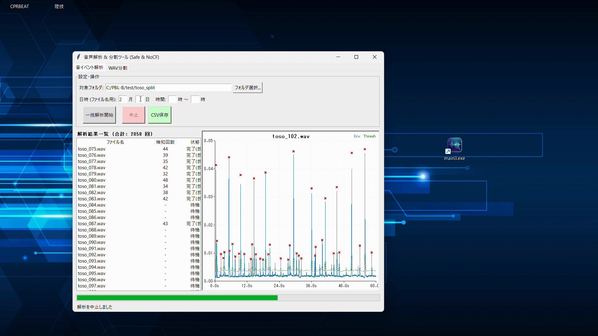

# 音による作業モニタリング


大学PBL授業における企業連携プロジェクト。  
**防爆室内に設置できないセンサーの代替手段**として、室外からの録音データを解析し、エアレス塗装機の稼働回数を自動カウントするデスクトップアプリケーション。

---

## 背景・課題

工場では**塗料の使用量・作業効率の把握**のため、エアレス塗装機の動作回数をカウントしたい。  
しかし塗装室は**防爆仕様**のため、電子機器を室内に設置できない。

> 解決策: 防爆室の外からマイクで録音し、Pythonで音声解析・カウントを行う

---

## システム構成

```
マイクで録音 → 録音データ転送 → Python で解析・カウント → CSV 保存
```

---

## アプリ画面



---

## 機能

| 機能 | 説明 |
|------|------|
| 音イベント一括解析 | フォルダ内の全WAVファイルを自動処理し、稼働回数をリスト表示 |
| 波形ビューア | エンベロープ・動的しきい値・検知ピークをリアルタイムで描画 |
| CSV出力 | 日時付きファイル名で解析結果を一括エクスポート |
| WAV分割 | 長時間録音を任意の分数単位に分割 |

---

## 技術的工夫

### 課題1: ノイズレベルが変動し固定しきい値では誤検知が起きる

工場内の騒音は時間帯によって大きく変動するため、固定のしきい値では塗装音を正確に検出できない。

**解決策: 動的しきい値**
1. 波形の絶対値に20ms幅の移動平均を適用しエンベロープを生成
2. エンベロープの局所平均（前後0.5秒）＋補正値をしきい値として設定
3. ノイズレベルの上昇に追従してしきい値も自動で上昇

### 課題2: 金属音（〜14kHz）が動作音と誤判定される

工場内の金属音がエアレス塗装機の動作音と類似した波形を示し、誤カウントが発生。

**解決策: 周波数帯域の特定と最適フィルター設定**
1. スペクトラム解析で金属音が14kHzまで、動作音が15kHz以上に分布することを確認
2. 15〜20kHz のバンドパスフィルタを適用し、動作音のみを抽出

### 課題3: ノイズのみのファイルで処理時間を無駄にする

録音ファイルの中には動作音が含まれないものも多く、全ファイルを解析すると非効率。

**解決策: クレストファクターによる自動スキップ**
- エンベロープの最大値÷平均値（クレストファクター）が閾値未満のファイルをカウント前にスキップ
- 処理時間を大幅に短縮しつつ、見逃しを防止

---

## 検証結果

実際の工場録音データ（125ファイル・各1分）を用いて動作確認。

| 指標 | 結果 |
|------|------|
| 解析ファイル数 | 125ファイル（1分割） |
| 合計検知回数 | **3,852 回** |
| 動的しきい値 | 実装・動作確認済み |
| ノイズファイルスキップ | 実装・動作確認済み |

---

## 技術スタック

| 用途 | ライブラリ |
|------|-----------|
| 信号処理 | scipy（butter filter, sosfiltfilt, find_peaks） |
| 数値計算 | numpy |
| GUI | tkinter（Canvas による軽量波形描画） |
| WAV 入出力 | scipy.io.wavfile, wave |
| CSV 出力 | csv（標準ライブラリ） |
| 並列処理 | threading |
| メモリ管理 | gc |

> matplotlib を使わず tkinter Canvas のみで波形描画することで、exe 化後の起動速度を向上

---

## インストール

```bash
git clone https://github.com/rururena6607/PBL-B.git
cd PBL-B
pip install -r requirements.txt
```

## 使い方

```bash
python main3.py
```

1. **音イベント解析タブ** → フォルダ選択 → 一括解析開始
2. ファイルをクリックすると波形・しきい値・検知ピークを表示
3. CSV保存ボタンで日時付きファイル名で結果をエクスポート

---

## ファイル構成

```
PBL-B/
├── main3.py          # メインアプリケーション
├── requirements.txt  # 依存ライブラリ
├── .gitignore
└── docs/             # スクリーンショット等
```

---

## 展望

- **動作音の重なり判定**: 複数台同時稼働時にパルス幅から台数を推定
- **塗装機の個体識別**: スペクトラム特性から機体ごとの稼働ログを分離
